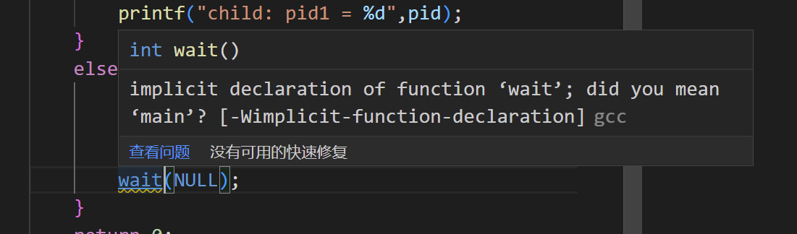
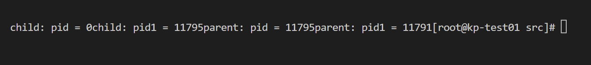
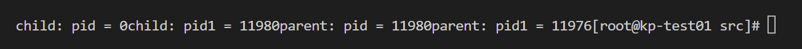
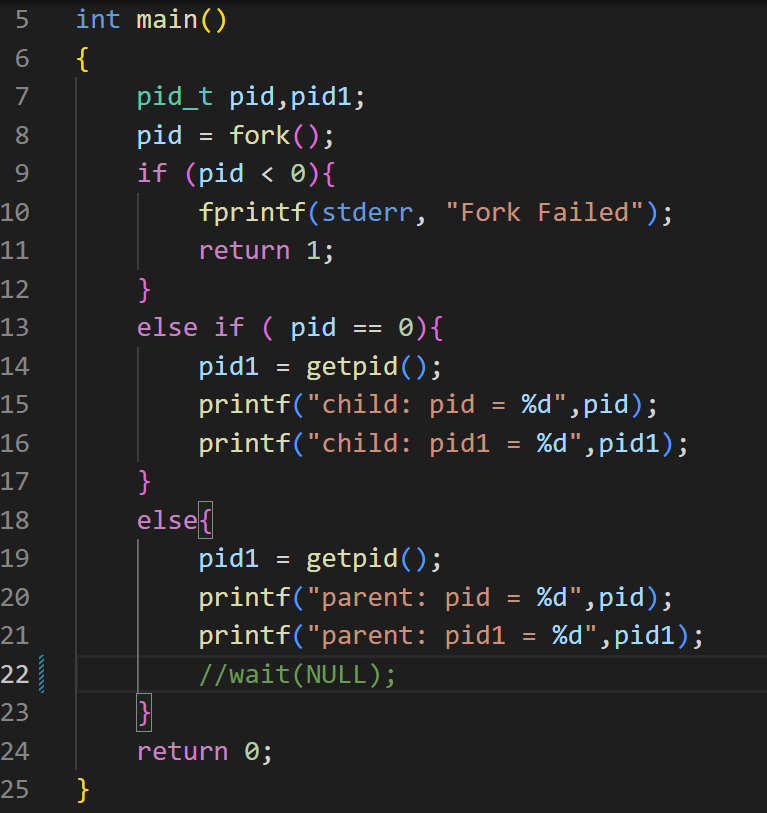
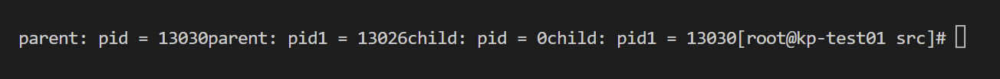
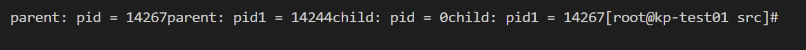
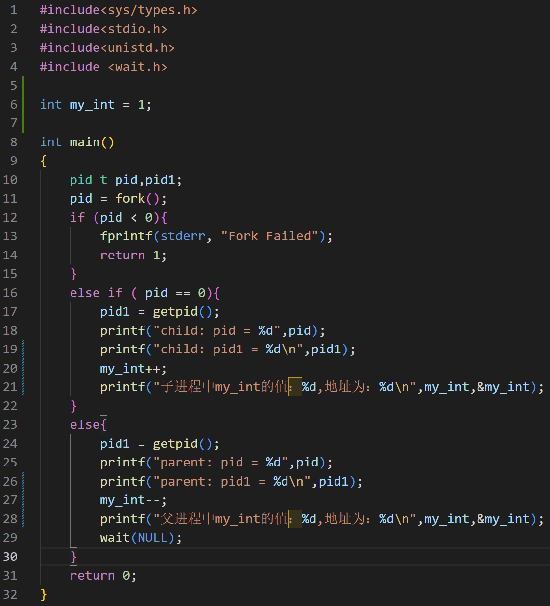
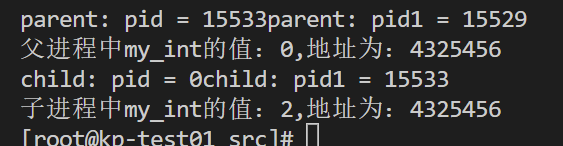

# 记录问题及解决过程    
    1. 书上源程序报错wait函数

解决方法：引入#include <wait.h>  [解决问题的链接][1]

# 实验的具体步骤
## 任务一
- 多次运行程序并且观察结果

结果分析：
    + 进行三次运行，从每次的结果我们可以发现子进程里面的pid1与父进程的pid相同，这是因为父进程经过fork返回的是子进程的pid，而子进程getpid()后获得自己的pid，二者当然相同
    + 子进程经过fork后获得的pid是0
    + 父进程gitpid()获得自己的pid，与子进程的不同，并且父进程的pid比子进程的小4

- 去掉wait()后运行程序
    
    
    
    
    结果分析
    + 这三次parent先输出，原因是注释掉了wait()函数,父进程不用等子进程执行完毕再执行
    + 其余特性与未注释掉wait()函数时一致
    
- 设置全局变量并进行分析
    + 设置了全局变量int my_int = 1 ,在子进程里面对其进行加操作，父进程里面对其进行减操作，输出相应的值和地址。
    + 代码如下：
    
    + 运行结果如下：
    
    + 结果分析：
        + pid与pid1的分析结果与前边实验相同
        + 父子进程的my_int的地址都是相同的，这是因为子进程采用了虚拟内存技术，实际地址为基址+偏移量，子进程实际上只是把偏移量拷贝过来了放在了不同的基址中。而输出地址时输出的是变量位置在各自基址上的偏移量。
        + 父进程中my_int值为0，子进程中my_int值为2，原因是采用了写时复制技术，子进程在写时将虚拟空间中的堆栈等变成实际的物理空间，子进程的资源实际上是父进程的拷贝，二者实际对应不同的my_int。

---
---

[1]: https://blog.csdn.net/wyhh_0101/article/details/83933308?ops_request_misc=%257B%2522request%255Fid%2522%253A%2522166633485316782390525276%2522%252C%2522scm%2522%253A%252220140713.130102334..%2522%257D&request_id=166633485316782390525276&biz_id=0&utm_medium=distribute.pc_search_result.none-task-blog-2~all~top_positive~default-1-83933308-null-null.142^v59^opensearch_v2,201^v3^add_ask&utm_term=wait&spm=1018.2226.3001.4187